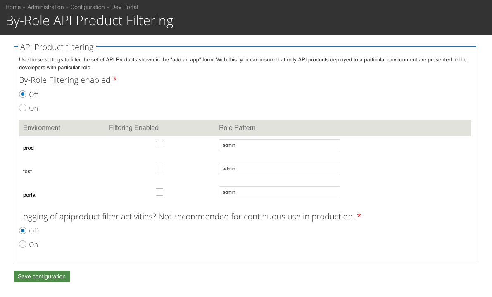

# apigee_filter_apiprod_byrole

This is a filter for API Product listings.

It filters API Products based on the role of the user, and the
environment to which the API Product is applied.  This is a coarse
filtering. It does not allow filtering based on the name of the API
product, or any other attribute of the API product.

## Notes on Configuration

Reach the admin panel via admin > config > devconnect > apiproducts > By-Role API Product Filtering.

The Admin panel allows you to enable filtering for specific Apigee Edge
environments.  For each environment in which filtering is enabled, you
can specify a regular expression for the roles that will see all API
Products there.

Example:

## Disclaimer

This module is not an official Google product, nor is it part of an official Google product.

## Warranty

This software is provided "as is", without warranty of any kind, express or implied,
including but not limited to the warranties of merchantability, fitness for a particular
purpose and noninfringement. In no event shall the authors or copyright holders be
liable for any claim, damages or other liability, whether in an action of contract, tort
or otherwise, arising from, out of or in connection with the software or the use or
other dealings in the software.

## Support Status

This module is not a supported part of the Apigee Edge Drupal-based developer portal.
This module is open-source software. If you need assistance, inquire on
[The Apigee Community Site](https://community.apigee.com).  There is no service-level
guarantee for responses to inquiries regarding this module.

## Bugs

* you need to use regular expressions to use this module.

